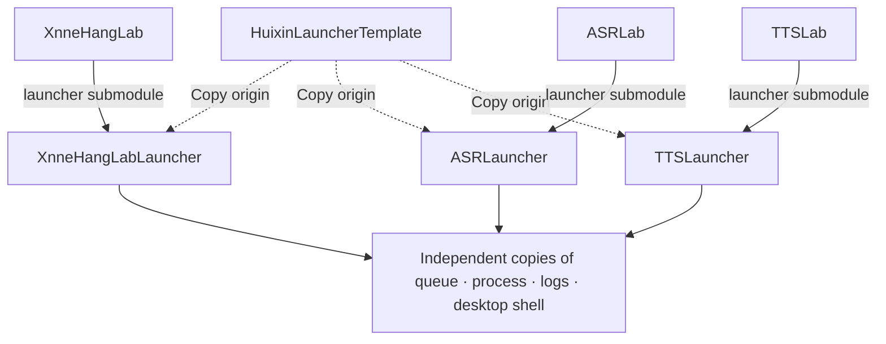
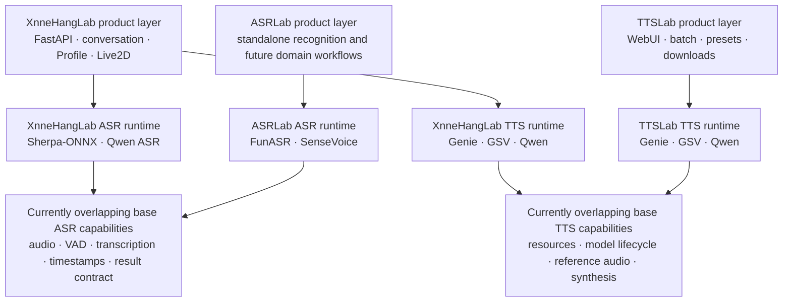
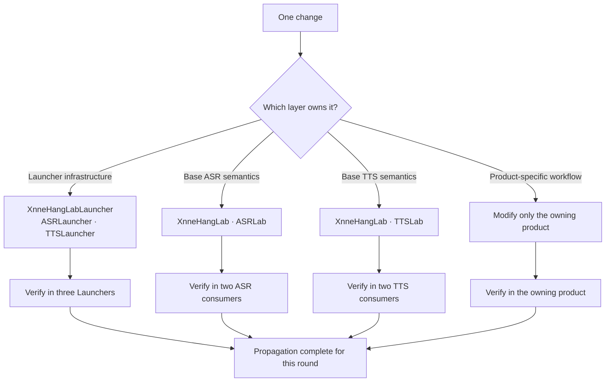
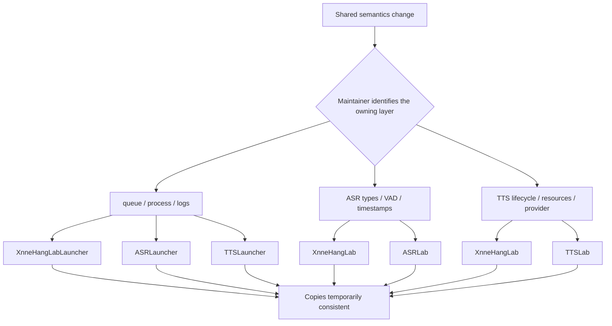
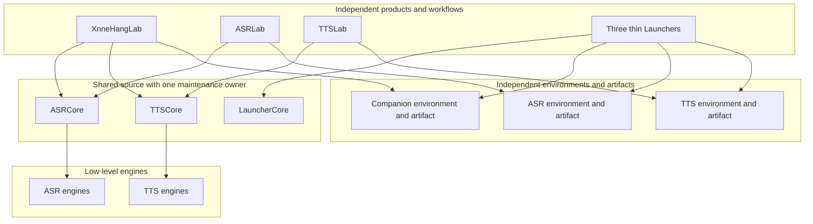
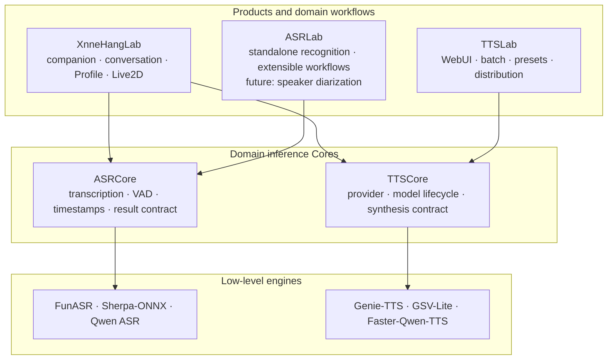
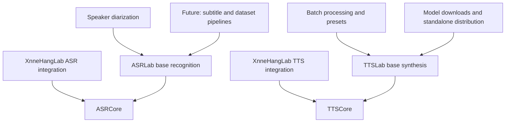
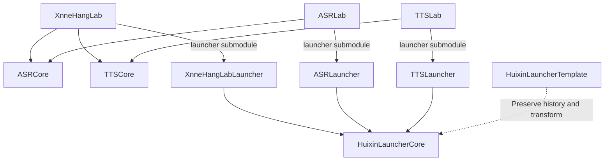
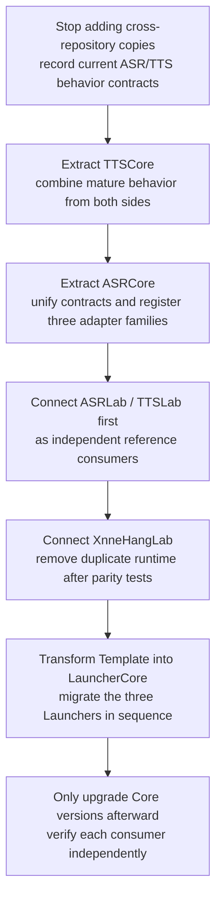

:::note[About This Article]
This is a maintenance retrospective grounded in XnneHangLab, ASRLab, TTSLab, and their Launchers. The opening presents a conclusion that applies to any project. From “Duplication Happened at Two Layers” onward, the article moves into repository-specific code evidence, ownership boundaries, and a migration plan intended for readers interested in this project family or similar multi-repository architectures.
:::

Splitting repositories is not decoupling.

If two repositories still rely on cherry-picking the same shared fixes, only the physical location of their source code has been separated. Their maintenance responsibility has not.

**Every new copy of shared code that is still evolving creates another maintenance responsibility that must continuously be evaluated, synchronized, and verified.**

I gradually realized this while maintaining three Labs and three Launchers: XnneHangLab, ASRLab, TTSLab, and the Launcher paired with each of them. On paper, they look like six repositories with clear boundaries. In practice, they overlap extensively. They are not six entirely independent products, but several product capabilities combined with multiple copies of shared mechanisms.

What I originally wanted to separate was quite reasonable:

- ASR and TTS each have heavy model and Python dependencies;
- specialist capabilities such as subtitles, batch processing, dataset production, and potentially speaker diarization in the future should not all live inside a desktop-companion product;
- different products need to be installed and run independently, and may follow different release schedules;
- the Launchers may look similar, but each ultimately serves a different product.

Those goals were sound.

The problem was that I wanted to isolate **runtime environments and product forms**, but reached for **copying source code and splitting repositories**. Those are not the same boundary.

> **If the general conclusion is all you need, you can stop here. The rest of the article examines the concrete repository evidence and engineering resolution for this project family.**

## Duplication Happened at Two Layers

The original split copied two layers of implementation that were still evolving. The Launcher layer was simply easier to see in Git history.

### Launcher: Three Copies of Desktop Infrastructure from One Template

All three Launchers need environment inspection, model downloads, a serial task queue, child-process lifecycle management, log events, and a similar Tauri, React, and Rust desktop shell. Copying a template into separate products was therefore a natural starting point: each repository became runnable immediately and could independently change its branding, pages, model catalog, and launch commands.

The solid lines represent real product dependencies: each Lab pins a specific commit of its Launcher submodule. The dotted lines represent copy lineage only; a template change does not automatically enter any Launcher. Environment inspection, download queues, process management, and log handling may now live in three repositories, but they are still the same mechanisms expected to evolve together.

### Lab: Base ASR and TTS Capabilities Are Also Maintained Twice

Source duplication did not stop at the desktop shell. XnneHangLab already integrates complete base ASR and TTS capabilities, while ASRLab and TTSLab each maintain an independent implementation of the corresponding domain.

“Overlap” does not mean that the engines and pages are byte-for-byte identical. It means that the current base domain capabilities are covered twice.

Both TTS implementations handle resource paths, device selection, model loading and release, reference audio, inference, and audio output for Genie-TTS, GSV-Lite, and Faster-Qwen-TTS. XnneHangLab connects them to conversation and Live2D; TTSLab provides a WebUI, batch processing, presets, downloads, and standalone distribution. Those product capabilities are legitimate. The duplicated part is the inference runtime beneath them, which still has two maintenance sources.

The two ASR implementations choose different engines, but both must read audio, run VAD, transcribe speech, normalize timestamps, and produce sentence output. Domain contracts such as `ASRResponse`, `VadResponse`, `Sentence`, `Word`, and `CutPoint`, together with converters, configuration, and audio utilities, also have explicit migration history from XnneHangLab into ASRLab.

Adding speaker diarization to ASRLab in the future would not change the fact that their base capabilities completely overlap today. It would only show that products can continue to diverge above a shared foundation.

At the moment of copying, both layers felt inexpensive. The real cost appeared when one copy received a bug fix and another copy was still expected to receive the same correction.

## The Same Fix Becomes a Different Commit

ASRLauncher and TTSLauncher provide a direct example.

Each currently has 139 comparable source and configuration files, of which 135 are byte-for-byte identical. After the fork, six infrastructure commit pairs acquired different commit hashes while producing identical patches:

- a port conflict no longer terminates the development server immediately;
- file download progress remains visible under React 18 batching;
- an indeterminate animation appears when no percentage is available;
- `tqdm` logs update in place in the console;
- Rust splits stderr on `\r` and `\n`;
- child-process stderr is read as raw bytes.

These changes first appeared in TTSLauncher and were later replayed into ASRLauncher in the same order. Git sees two different commit sequences; their patch IDs show the same set of changes.

Launcher history provides the easiest symptom to quantify. The Lab layer does not necessarily produce matching commits: ASR migrated with a common contract and conversion logic before continuing to evolve, while TTS maintains parallel implementations of the same runtime responsibilities above common engines. The Git traces differ, but the architectural problem is the same: one shared semantic change must be reconsidered and revalidated in several places.

This is the point at which cross-repository cherry-picking becomes architecture.

A cherry-pick begins as a Git operation: apply one commit to another branch or repository. Once shared code has multiple maintained copies, however, it assumes an architectural responsibility: **keeping those copies consistent**.

Typing `git cherry-pick` is not the expensive part. The expensive part is first determining which layer changed, then remembering which repositories currently contain that layer, and finally verifying the change in each product context.

The cost lies in the surrounding judgments:

1. Is this fix product logic or a shared mechanism?
2. Which other repositories have the same problem?
3. Have those implementations already developed different assumptions?
4. Can the patch be applied unchanged, or must it be adapted manually?
5. Which tests should run in each repository?
6. When a similar issue appears later, will I remember this propagation relationship?

Git can tell me whether a patch conflicts. It cannot tell me which other repository should receive that patch.

## The Most Dangerous Case Is Not a Conflict, but No Conflict

Merge conflicts are the most visible problem in cross-repository synchronization, but they are not the most dangerous one.

A conflict interrupts the operation and clearly announces that two copies have diverged. The harder failures to discover are these:

First, a patch applies cleanly even though configuration semantics, error handling, or lifecycle assumptions have diverged between products. The code appears synchronized, but the behavior may no longer be equivalent.

Second, one repository is simply forgotten. It produces no conflict, does not fail CI, and leaves no error message. Only when the old bug reappears later does anyone discover that one copy remained in the past.

The central risk of cross-repository cherry-picking is therefore not that patches are difficult to merge, but that **change propagation depends on maintainer memory**.

This dependency graph does not exist in code or a dependency manifest. It exists only in the maintainer’s head. The maintainer must remember not only that another copy exists, but exactly which repositories contain a particular semantic layer. A forgotten edge produces neither a conflict nor an automatic CI failure.

Every additional copy adds more than another file. It adds another propagation path, another context to understand, and another validation pass.

This cost also arrives unevenly. It hides during quiet periods and then erupts when shared mechanisms begin changing frequently. That makes copying easy to underestimate on the day it happens: the immediate gain is a complete runnable codebase, while the future synchronization obligation is recorded nowhere.

## Six Repositories Do Not Create Six Maintainers

Independent repositories often create an illusion: once code has been separated, each repository can develop independently.

But an independent repository requires more than its own Git URL. It needs independent maintenance capacity:

- someone continuously handles its issues and dependency upgrades;
- it has its own tests and release schedule;
- it can decide independently how shared behavior should evolve;
- it can continue to be maintained even if the other repositories stop development.

If one person still maintains all six repositories, splitting them does not create more maintenance capacity. It divides the same attention across more contexts.

XnneHangLab and its Launcher continue to evolve actively, while ASRLab, TTSLab, and the two voice Launchers follow noticeably different commit, testing, CI, and release rhythms. In that situation, “identical code in independent repositories” does not mean the code gained independent maintainers. It means the same person must reconsider shared changes in more places.

This is also why satellite repositories tend to stagnate: repository independence isolates changes, but it also isolates the satellite from the fixes, tests, and continuous attention the main repository receives naturally.

## Which Boundary Did I Split Incorrectly?

Looking back, the question is not whether splitting was inherently right or wrong. The problem was failing to separate five kinds of boundary first:

1. **Source boundary**: which code has exactly one maintenance source?
2. **Repository boundary**: which code must share one Git history?
3. **Dependency and environment boundary**: which capabilities need independent Python, CUDA, model, and system dependencies?
4. **Artifact boundary**: how many installers, images, or executables should be built?
5. **Product boundary**: how many distinct products do users see?

These boundaries may coincide, but they are not naturally identical.

The sharing in this diagram happens at the source layer: the common ASR, TTS, and Launcher mechanisms each have one maintenance source. Products remain free to combine different capabilities, while environments retain independent Python, CUDA, model, and release artifacts.

What I actually wanted was independent dependency environments, specialist capabilities, and product artifacts. Instead, I also copied source code that would continue to change. Repository splitting solved environment isolation while creating a source synchronization problem.

## Code Duplication Is Not the Original Sin; Duplicated Evolution Is

Not every copy creates this debt.

If a template is copied and the resulting projects are then allowed to diverge independently, with no expectation of future synchronization, it is simply a shared historical starting point. Their subsequent divergence is fine.

If a piece of code is extremely stable and almost never changes, the long-term cost of copying it may also be lower than the complexity of introducing a shared dependency.

The risky code has a different profile:

- it belongs to infrastructure or a shared mechanism;
- it is still being fixed and extended frequently;
- several products expect to keep receiving those updates;
- it has no explicit unique maintenance source;
- propagation depends on maintainer memory and cross-repository cherry-picks.

At that point, what was copied was not merely a source snapshot, but its entire future change history.

The debt can be understood roughly as:

> Maintenance debt ≈ number of copies × shared-code change frequency × propagation judgment cost × per-repository validation cost

This is not a formula for calculating engineering hours. It explains why copying one more repository feels almost free today while its long-term cost can grow rapidly.

## How to Pay Down the Debt in Engineering Terms

For a general reader, the broad conclusion is already enough: do not mistake a repository boundary for a module boundary.

For these three Labs and three Launchers, however, one question remains: **how can the overlapping implementation gain one maintenance source while product capabilities remain free to diverge?**

### Four Layers, Not Three Large Repositories

The solution is not to make XnneHangLab depend on all of ASRLab or TTSLab. That would pull Gradio, download tooling, subtitle pipelines, and future speaker diarization into the desktop-companion product, recreating a confused dependency direction.

A cleaner architecture has four layers:

1. **Low-level engines**: FunASR, Sherpa-ONNX, Qwen ASR, Genie-TTS, GSV-TTS-Lite, and Faster-Qwen-TTS;
2. **Domain inference Cores**: shared model lifecycle, inputs, outputs, and processing for ASR and TTS;
3. **Products and domain workflows**: XnneHangLab, ASRLab, and TTSLab each compose Cores while continuing to develop their own capabilities;
4. **Desktop infrastructure**: three Launchers share one Launcher Core while retaining product adapters.

The arrows show dependency direction: products depend on Cores, and Cores depend on low-level engines. A Core never imports a product in reverse.

#### What Belongs in ASRCore

ASRCore owns the parts every ASR consumer must understand consistently:

- canonical types for `ASRResponse`, `VadResponse`, `Sentence`, `Word`, and alignment results;
- shared primitives for audio decoding, sample rates, and duration;
- interfaces for transcription, VAD, model loading, and release;
- timestamp normalization, sentence conversion, splitting, and merging;
- pluggable adapters for FunASR / SenseVoice, Sherpa-ONNX, and Qwen ASR.

Above the Core, XnneHangLab retains upload routes, service lifecycle, companion conversations, and product error handling. ASRLab retains its standalone recognition experience and provides a home for future capabilities such as subtitle generation, batch workflows, dataset production, and speaker diarization.

The boundary is not “does XnneHangLab have this feature?” It is “does a second product also need to maintain the same base semantics?” A shared `Sentence` structure and timestamp transformation should not be copied again merely because one product adds speaker labels.

#### What Belongs in TTSCore

TTSCore owns the domain layer shared by the three TTS providers:

- canonical synthesis requests, results, voice specifications, and model descriptions;
- a provider interface plus adapters for Genie-TTS, GSV-Lite, and Faster-Qwen-TTS;
- resource-path patching, model loading and release, device selection, and status queries;
- reference-audio and reference-text handling;
- shared PCM and WAV serialization.

Above it, XnneHangLab retains Profile-to-voice resolution, FastAPI, conversation ordering, WebSocket delivery, and Live2D playback. TTSLab retains its model directory, download verification, Gradio WebUI, batch processing, presets, and standalone distribution.

With this boundary, one fix to GSV-Lite model caching or Qwen-TTS release behavior reaches both products through a TTSCore upgrade. The products remain free to expose the capability in entirely different ways.

### Future Divergence Happens Above the Core

Extracting the currently overlapping foundation does not require ASRLab and TTSLab to remain forever identical to XnneHangLab. It determines the layer at which divergence should occur.

Speaker diarization, for example, can consume ASRCore audio and timestamp results and produce a domain output with speaker labels. If only ASRLab needs it, ASRLab owns it independently. If XnneHangLab later needs the same capability, it can depend on that public feature rather than placing every imaginable feature into the Core in advance.

The rule becomes:

- **base implementations with multiple real consumers today** enter a Core;
- **workflows serving one product** remain in that product repository;
- reusable pieces move downward only when a second consumer actually appears, not in anticipation of one.

### Connecting Three Cores to the Seven Existing Repositories

Domain Cores should be Python packages whose versions can be pinned independently. They may enter both consumers through a Git dependency, a package version, or a submodule. If visible source and commit-level pinning matter operationally today, a submodule is a natural choice.

The Launcher side needs a third shared Core: `HuixinLauncherCore`.

Each repository can then have a clear responsibility:

| Unique maintenance source | Responsibility                                                                                                              |
| ------------------------- | --------------------------------------------------------------------------------------------------------------------------- |
| ASRCore                   | ASR domain contracts, shared audio/VAD/transcription pipeline, and recognition-engine adapters                              |
| TTSCore                   | TTS domain contracts, provider adapters, model lifecycle, reference audio, and shared serialization                         |
| HuixinLauncherCore        | Tauri task/process/event infrastructure plus the React desktop shell and generic task UI                                    |
| XnneHangLab               | Companion-product orchestration, conversation, Agent/plugins, Profile, Live2D, and product integration of ASR/TTS           |
| ASRLab                    | Standalone ASR product and future domain workflows, including planned subtitle/dataset and speaker-diarization capabilities |
| TTSLab                    | Standalone TTS product, resource catalog and downloads, WebUI, batch processing, presets, and distribution                  |
| Three product Launchers   | Branding and Tauri metadata, product routes, CLI/environment/resource adapters, and product-specific pages                  |

The low-level engine repositories remain, but they sit beneath ASRCore and TTSCore. GSV-TTS-Lite provides the unique source of the GSV inference implementation. TTSCore provides the unique source for how products consistently load, invoke, and release several TTS engines. They are different responsibilities at different layers.

Likewise, one Lab repository should not be imported wholesale by another. XnneHangLab consumes ASRCore and TTSCore, not ASRLab’s complete subtitle workflow or TTSLab’s Gradio product.

Before moving code physically, its provenance and license must be checked. XnneHangLab and ASRLab are currently AGPL, while TTSLab is MIT. Extracted implementations must preserve their actual origin, contributor history, and applicable license; creating a new Core does not create new licensing assumptions.

### The Template Repository Can Retire, but Its History Needs a Successor

The Launcher evidence remains the clearest. Comparing `src/` and `src-tauri/src/`, HuixinLauncherTemplate, ASRLauncher, and TTSLauncher each contain the same 61 source paths. ASRLauncher and TTSLauncher have byte-identical contents in 57 of them, while the template has no unique source path and is already behind the two products in 24 common files. This source-only count uses a different scope from the earlier total of 139 source and configuration files.

ASRLauncher still invokes `xnnehanglab_tts.cli` and reads `XH_VOICE_WORKSPACE_ROOT`. That shows the template never separated product adapters from shared mechanisms; it simply allowed a TTS Launcher to be copied onward into another product.

The template repository therefore no longer has an independent responsibility as “the latest Launcher to copy.” The least disruptive path is not to delete its history immediately, but to transform it in place into `HuixinLauncherCore`, or to establish the Core, migrate all three consumers, and then archive the template repository.

LauncherCore retains only:

- Rust/Tauri task models, serial queues, environment probes, process lifecycle, logs, and the event bridge;
- React/TypeScript AppShell, navigation, window controls, theme, generic console, task, and progress components.

`xnnehanglab_tts.cli`, `XH_VOICE_WORKSPACE_ROOT`, model IDs, character names, product routes, and Live2D/Profile tools all remain in the product-adapter layer of the three Launchers.

### Migration Order

The three Cores do not need to be rewritten simultaneously. First capture existing behavior as contracts, then replace maintenance sources one layer at a time.

TTSCore should be extracted from the union of both implementations. XnneHangLab has a mature service lifecycle, streaming output, and product error handling; TTSLab has a standalone resource layout, download verification, and file output. Only the domain semantics both products need belong in the Core. FastAPI and Gradio remain in their respective products.

ASRCore first stabilizes types, VAD/transcription interfaces, and the timestamp/sentence pipeline, then registers FunASR/SenseVoice, Sherpa-ONNX, and Qwen ASR as adapters. ASRLab and XnneHangLab may select different adapters without duplicating the domain contract and post-processing.

Each migration should run old and new implementations against the same golden cases, comparing text, timestamps, audio formats, error states, and resource lifecycle. A duplicate implementation leaves its original repository only after the consumer passes parity validation.

The repository count may not shrink after migration; adding three Cores could even increase it. But each repository would finally have a non-overlapping maintenance responsibility: engines maintain engines, domain Cores maintain shared inference semantics, Labs maintain products and domain workflows, and LauncherCore maintains desktop infrastructure.

## Questions I Will Ask Before Splitting Repositories Again

Before making a similar split in the future, I will answer these questions:

1. Am I trying to isolate source code, dependencies and runtime, release artifacts, or user-facing products?
2. Will the copied code continue to evolve?
3. After fixing one copy, are the other repositories still expected to receive the fix?
4. What is the unique maintenance source for this shared code?
5. Is change propagation handled by dependencies and versions, or by maintainer memory?
6. Does every repository really have independent maintainers, tests, and release schedules?
7. If a satellite repository stagnates for a year, can the main product still change the shared mechanism safely?
8. If the answer is still “modify this repository, then cherry-pick the others,” what did the repository boundary actually isolate?

One rule is more useful than all the others:

> **If shared code is still expected to evolve in sync, give it one maintenance source before deciding how different products will consume it.**

## Closing

Repository splitting solves real problems: heavy dependencies, different runtime environments, different release schedules, different users, and different product forms.

But a Git repository is only a storage and collaboration boundary. It does not automatically create module boundaries or erase evolutionary relationships between pieces of code.

The lesson from three Labs and three Launchers is not that there are too many repositories. It is that I once mistook “the code lives in different repositories” for “the code is independent.” As long as one shared fix must propagate across repositories, those repositories remain coupled. The coupling is no longer expressed by imports or dependency manifests, but by cherry-picks, manual judgment, and maintainer memory.

That coupling is less visible and therefore easier to underestimate.

For a general reader, the conclusion can end here. For this repository family, the engineering outcome is more concrete:

- move currently overlapping base implementations into ASRCore, TTSCore, or LauncherCore so each has one maintenance source;
- keep future product divergence above the Core while continuing to build independent artifacts;
- give low-level engines, domain inference, product workflows, and desktop infrastructure separate boundaries;
- replace cherry-pick propagation with explicit dependency-version upgrades;
- use templates only to generate projects intended to diverge independently, never as a long-term update channel.

**Splitting repositories is not decoupling. Copying shared code that is still evolving merely converts code coupling into synchronization coupling—and eventually into maintenance debt.**
