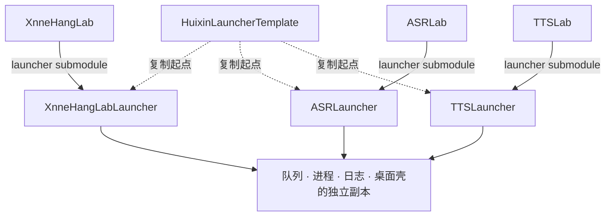
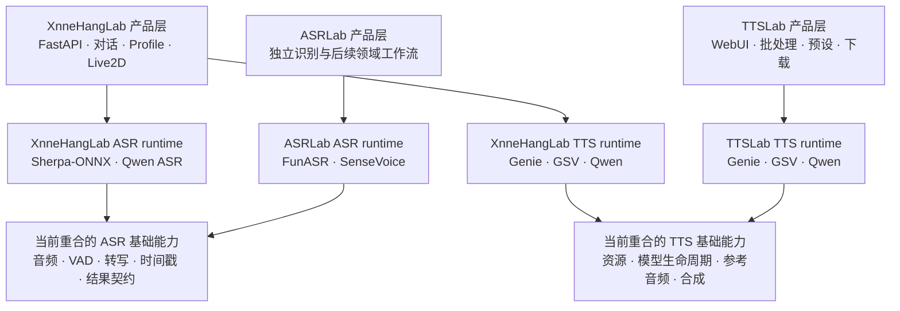
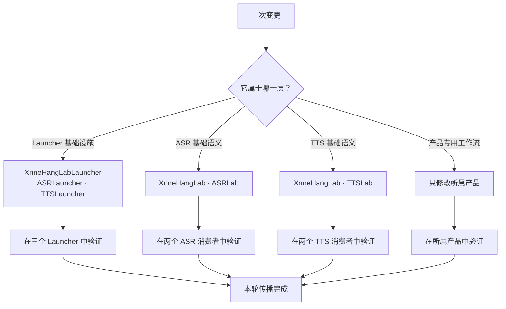
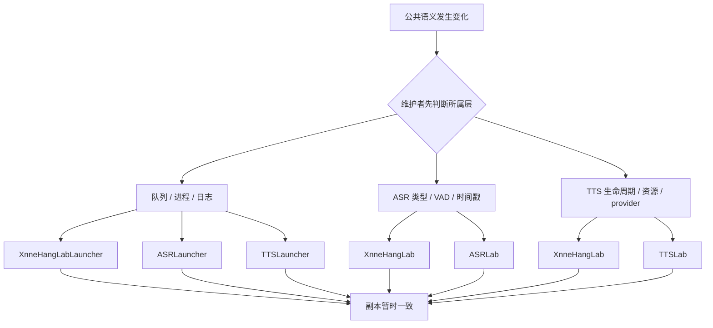
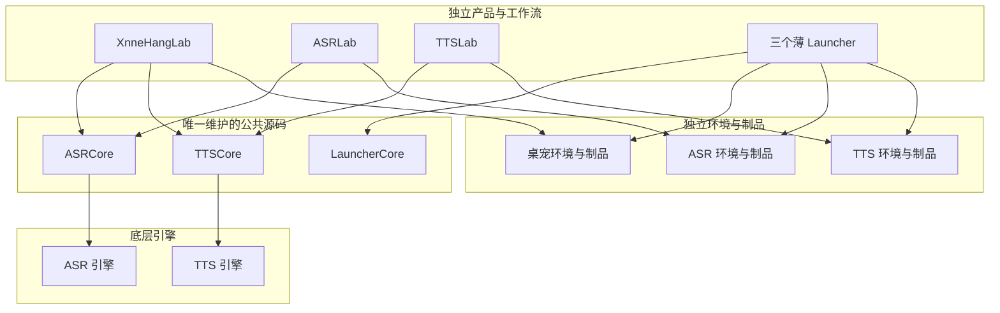
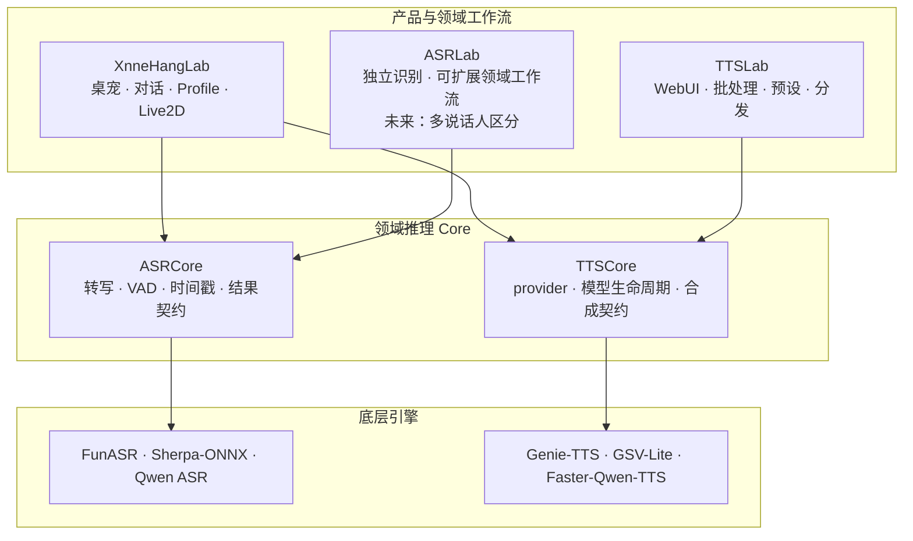
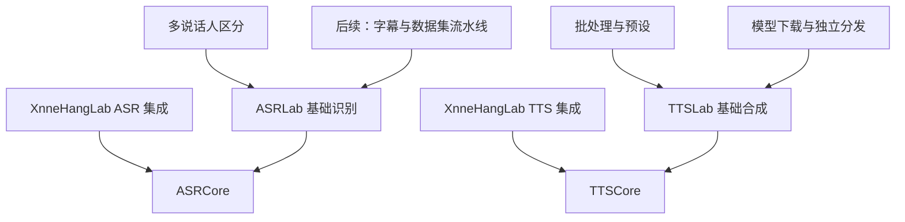
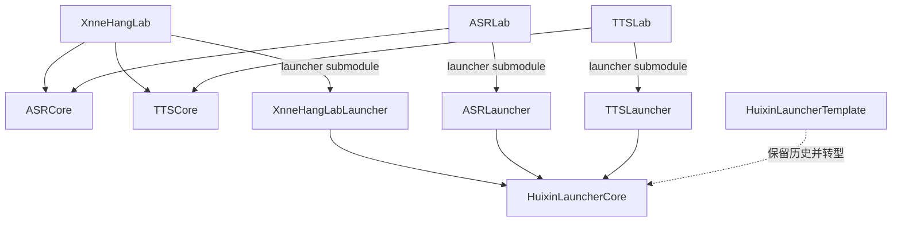
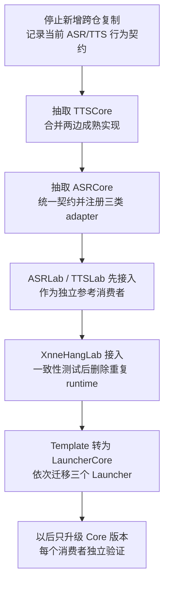

:::note[关于这篇文章]
这是一篇以 XnneHangLab、ASRLab、TTSLab 及其 Launcher 为背景的维护复盘。开头先给出任何项目都可以使用的结论；从“复制发生在两层”开始，正文会进入这些仓库的具体代码证据、所有权边界和迁移方案，只适合对这组项目或类似多仓架构感兴趣的读者。
:::

拆仓不等于解耦。

如果两个仓库之间仍然需要靠 cherry-pick 同步同一套公共修复，那么它们只是把源码的物理位置拆开了，维护责任并没有拆开。

**每复制一份仍在演进的公共代码，就新增了一份需要持续判断、同步和验证的维护责任。**

这件事我是在维护三个 Lab 和三个 Launcher 之后才逐渐意识到的：XnneHangLab、ASRLab、TTSLab，以及分别对应它们的三个 Launcher。看起来是六个边界清楚的仓库，实际维护时却存在大量重合。它们并不是六套完全独立的产品，而是几套产品能力与多份公共机制的组合。

最开始，我想拆开的东西其实很明确：

- ASR 与 TTS 有各自很重的模型和 Python 依赖；
- 字幕、批处理、数据集制作，以及以后可能加入的多说话人区分等专业能力，不应该全部塞进桌宠产品；
- 不同产品需要独立安装、独立运行，也可能有不同发布节奏；
- Launcher 虽然长得相似，但最终服务的是不同产品。

这些目标都没有问题。

问题在于，我想隔离的是**运行环境和产品形态**，最后采用的手段却是**复制源码并拆分仓库**。这两个边界不是一回事。

> **如果你只关心一般结论，读到这里已经够了。下面进入这组仓库的具体证据与工程解。**

## 复制发生在两层

最初的拆分同时复制了两层仍在演进的实现，只是 Launcher 层更容易从 Git 历史里看出来。

### Launcher：从一份模板复制出三套桌面基础设施

三个 Launcher 都需要环境检测、模型下载、串行任务队列、子进程生命周期、日志事件，以及相似的 Tauri、React 与 Rust 桌面壳。从模板复制出不同产品，因此是一个很自然的开始：每个仓库立刻可以运行，也能独立修改品牌、页面、模型清单和启动命令。

实线表示现在真实存在的产品依赖：每个 Lab 固定自己 Launcher 的 submodule commit。虚线只表示复制血缘；模板变化不会自动进入任何 Launcher。环境检测、下载队列、进程管理和日志处理虽然已经住进三个仓库，仍然是需要同步演进的同一种机制。

### Lab：基础 ASR/TTS 能力也被维护了两遍

源码复制没有停在桌面壳。XnneHangLab 本身已经集成了完整的基础 ASR 与 TTS，而 ASRLab、TTSLab 又分别维护了独立实现。

这里的“重合”不是指引擎和页面逐字相同，而是指当前基础领域能力被完整覆盖了两遍。

TTS 两边都在处理 Genie-TTS、GSV-Lite 与 Faster-Qwen-TTS 的资源路径、设备选择、模型加载与释放、参考音频、推理和音频输出。XnneHangLab 把它们接进对话与 Live2D；TTSLab 则提供 WebUI、批处理、预设、下载和独立分发。这些产品能力都是合理的，重复的是它们下面的推理 runtime 仍有两个维护源。

ASR 两边虽然选择了不同引擎，但都要完成音频读取、VAD、转写、时间戳归一化和句子输出。`ASRResponse`、`VadResponse`、`Sentence`、`Word`、`CutPoint` 等领域契约，以及转换器、配置和音频工具，还有从 XnneHangLab 迁入 ASRLab 的明确历史。

未来 ASRLab 增加多说话人区分，并不会改变今天基础能力完全重合的事实。它只说明产品可以在共同基础之上继续分化。

刚复制时，这两层都很轻松。真正的成本要等第一份副本开始修 bug、另一份副本仍然期待获得同一修复时才会出现。

## 同一个修复，变成不同的 commit

ASRLauncher 与 TTSLauncher 提供了一个很直接的例子。

它们当前各有 139 个可比较的源码与配置文件，其中 135 个文件逐字节完全相同。分叉之后，还有 6 组基础设施提交拥有不同的 commit hash，却产生完全相同的 patch：

- 端口冲突不再让开发服务器直接退出；
- React 18 批处理下始终显示文件下载进度；
- 无法取得百分比时显示不定进度动画；
- `tqdm` 日志在控制台原地更新；
- Rust 按 `\r` / `\n` 拆分 stderr；
- 子进程 stderr 改为读取原始字节。

这些提交最初出现在 TTSLauncher，后来又按原顺序移植到 ASRLauncher。Git 里，它们是两组不同的提交；从 patch-id 看，它们又是同一批修改。

Launcher 历史给出了最容易量化的一种症状。Lab 侧未必表现为同一批 commit：ASR 是带着共同契约与转换逻辑迁出后继续演化，TTS 则是在相同引擎之上平行维护同一类 runtime。Git 轨迹不同，架构问题却相同：一次公共语义变化，需要在多个位置重新判断和验证。

这正是跨仓 cherry-pick 开始成为架构的时刻。

cherry-pick 原本只是一个 Git 操作：把某个提交应用到另一个分支或仓库。但当公共代码存在多个维护副本时，它开始承担一项架构职责：**维持多个副本之间的一致性。**

真正昂贵的从来不是敲一次 `git cherry-pick`。昂贵的是先判断这次变更属于哪一层，再想起这一层当前存在于哪些仓库，最后在不同产品上下文里分别验证。

昂贵的是它前后的判断：

1. 这个修复属于产品逻辑，还是公共机制？
2. 另外几个仓库是否也存在同一个问题？
3. 它们的代码是否已经产生不同假设？
4. 补丁能否原样应用，还是需要手工调整？
5. 每个仓库分别应该运行哪些测试？
6. 以后出现相似问题时，我还能否记得这次传播关系？

Git 可以告诉我补丁有没有冲突，却不能告诉我还有哪个仓库应该接收这份补丁。

## 最危险的不是冲突，而是没有冲突

跨仓同步最显眼的问题是 merge conflict，但它反而不是最危险的部分。

冲突会中断操作，明确告诉我两个副本已经产生分歧。真正难发现的是下面两种情况：

第一种，补丁可以干净地应用，但两个产品的配置语义、错误处理或生命周期已经不同。代码看起来同步成功了，行为却未必仍然一致。

第二种，某个仓库根本没有被想起来。它不会产生冲突，不会让 CI 失败，也不会留下任何错误提示。只有以后再次遇到旧 bug，才会发现其中一个副本停在了过去。

因此，跨仓 cherry-pick 的核心风险不是“补丁很难合”，而是**变更传播依赖维护者记忆**。

这张依赖图并不存在于代码或依赖清单里，只存在于维护者脑中。维护者不仅要记得“还有副本”，还要记得某种语义究竟复制到了哪几个仓库。任何一条遗漏的边都不会产生冲突，也不会主动让 CI 失败。

每增加一个副本，增加的并不只是一份文件，而是一条新的变更传播路径、一套新的上下文，以及一次新的验证。

而且这种成本不会均匀出现。它通常潜伏在平时，等到公共机制频繁演进时集中爆发。于是维护者很容易在复制的当天低估它：当天获得的是完整可用的代码，未来承担的却是没有写进仓库里的同步义务。

## 六个仓库并不会产生六个维护者

仓库独立经常会给人一种错觉：既然代码被拆开了，它们就可以独立发展。

但独立仓库真正成立的前提，不是拥有独立的 Git URL，而是拥有独立的维护能力：

- 有人持续处理它的 Issue 和依赖升级；
- 有自己的测试和发布节奏；
- 能独立决定公共行为如何演进；
- 即使其他仓库停止开发，它也能继续维护。

如果六个仓库最终仍由同一个人维护，拆仓不会自动增加维护能力。它只是把同一份注意力切成更多上下文。

XnneHangLab 与它的 Launcher 仍在持续演进；ASRLab、TTSLab 和两个语音 Launcher 的提交、测试、CI 与发布节奏却明显不同。此时，“相同代码位于独立仓库”并不意味着它们获得了独立维护者，只意味着公共修改需要由同一个人在更多位置重复判断。

这也是为什么卫星仓库很容易停滞：独立仓库隔离了变更，却也隔离了主仓自然获得的修复、测试和持续关注。

## 我拆错了哪一层边界

回头看，问题不是“该不该拆”，而是拆分时没有先区分下面五种边界：

1. **源码边界**：哪些代码只有一个维护源？
2. **仓库边界**：哪些代码必须放在同一个 Git 历史里？
3. **依赖与环境边界**：哪些能力需要独立的 Python、CUDA、模型和系统依赖？
4. **制品边界**：最终要构建几个安装包、镜像或可执行程序？
5. **产品边界**：用户看到的是几个独立产品？

这五种边界可以重合，但它们并不天然相同。

图里的共享关系发生在源码层：ASR、TTS 和 Launcher 的公共机制各自只有一个维护源。产品层仍然可以组合不同能力，环境层仍然保留独立的 Python、CUDA、模型和发布制品。

我当时真正想得到的是独立的依赖环境、专业能力和产品制品，却顺手复制了仍然会持续变化的源码。拆仓解决了环境隔离，同时制造了源码同步问题。

## 代码重复不是原罪，演进重复才是

并不是所有复制都会形成这种债务。

如果一份模板在复制后就各自独立，双方不再期待同步，它只是两个产品共同的历史起点。之后它们如何分化都没有问题。

如果一段代码非常稳定，几乎不会修改，复制的长期成本也可能低于引入共享依赖的复杂度。

真正需要警惕的是这种代码：

- 它属于基础设施或公共机制；
- 它仍在频繁修复和演进；
- 多个产品都希望继续获得它的更新；
- 却没有一个明确的唯一维护源；
- 传播更新依靠维护者记忆和跨仓 cherry-pick。

此时，复制的已经不只是一份源码快照，而是它未来的整个变更历史。

可以把这笔债务粗略理解成：

> 维护债务 ≈ 副本数量 × 公共代码变更频率 × 传播判断成本 × 各仓验证成本

这不是一个用来计算工时的公式，但它解释了为什么“再复制一个仓库”在当下几乎免费，长期成本却会快速上升。

## 工程上怎么还债

到这里，作为一般性的结论其实已经够了：不要把仓库边界误认为模块边界。

但对这三个 Lab 和三个 Launcher 来说，只停在结论还不够。我还需要回答一个更具体的问题：**如何让当前重合的实现只有一个维护源，又允许产品能力以后继续分化？**

### 需要拆成四层，而不是三套大仓库

工程解不是让 XnneHangLab 直接依赖整个 ASRLab 或 TTSLab。那会把 Gradio、下载器、字幕流水线和未来的说话人区分一并塞进桌宠产品，也会让依赖方向重新混乱。

更合适的边界是四层：

1. **底层引擎**：FunASR、Sherpa-ONNX、Qwen ASR、Genie-TTS、GSV-TTS-Lite、Faster-Qwen-TTS；
2. **领域推理 Core**：统一 ASR/TTS 的模型生命周期、输入输出与公共处理；
3. **产品与领域工作流**：XnneHangLab、ASRLab、TTSLab 各自组合 Core，继续发展自己的能力；
4. **桌面基础设施**：三个 Launcher 共享一套 Launcher Core，各自保留产品适配。

箭头表示依赖方向：产品依赖 Core，Core 依赖底层引擎。Core 不反向 import 任意一个产品。

#### ASRCore 应该拥有什么

ASRCore 负责所有 ASR 消费者都需要稳定理解的部分：

- `ASRResponse`、`VadResponse`、`Sentence`、`Word`、对齐结果等统一类型；
- 音频解码、采样率与时长等公共原语；
- 转写、VAD、模型加载与释放的接口；
- 时间戳归一化、句子转换、切分与合并；
- FunASR / SenseVoice、Sherpa-ONNX、Qwen ASR 等可插拔 adapter。

XnneHangLab 只在 Core 之上保留上传路由、服务生命周期、桌宠会话与错误处理。ASRLab 则在 Core 之上保留独立识别体验，并为字幕、批处理、数据集制作与多说话人区分等后续能力提供位置。

这里的分界不是“XnneHangLab 有没有这个功能”，而是“第二个产品是否也需要维护同一种基础语义”。同一个 `Sentence` 结构和时间戳转换不应该因为一个产品增加了说话人标签，就重新复制一份。

#### TTSCore 应该拥有什么

TTSCore 负责三个 TTS provider 共同的领域层：

- 统一的合成请求、合成结果、声音与模型描述；
- provider 接口及 Genie-TTS、GSV-Lite、Faster-Qwen-TTS adapter；
- 资源路径修补、模型加载/释放、设备选择和状态查询；
- 参考音频与参考文本处理；
- PCM / WAV 等公共音频序列化。

XnneHangLab 在它上面保留 Profile 到声音资源的解析、FastAPI、对话顺序、WebSocket 与 Live2D 播放。TTSLab 在它上面保留模型目录、下载校验、Gradio WebUI、批处理、预设和独立分发。

这样，修复一次 GSV-Lite 的模型缓存或一次 Qwen-TTS 的释放逻辑，两个产品通过升级 TTSCore 获得同一份修复；它们如何向用户暴露这份能力，仍然可以完全不同。

### 未来分化发生在 Core 之上

把当前重合部分抽成 Core，并不会要求 ASRLab 和 TTSLab 永远与 XnneHangLab 功能相同。它只确定了分化应该发生在哪一层。

例如，多说话人区分可以消费 ASRCore 的音频与时间戳结果，再生成带 speaker label 的领域输出。只有 ASRLab 需要它，就由 ASRLab 独立维护；以后 XnneHangLab 也需要时，再依赖这项公开能力，而不是预先把所有可能功能都塞进 Core。

判断标准因此变成：

- **现在有多个真实消费者的基础实现**进入 Core；
- **只服务一个产品的工作流**留在产品仓库；
- 当第二个消费者真正出现，再把可复用部分下沉，而不是按想象提前抽象。

### 三个 Core 与七个现有仓库怎么连接

领域 Core 应该是可独立固定版本的 Python package。它们可以使用 Git 依赖、包版本或 submodule 进入两个消费者；如果当前工程更需要源码可见和 commit 级锁定，submodule 是自然选择。

Launcher 侧则需要第三个共享 Core：`HuixinLauncherCore`。

这时每个仓库的责任可以清楚地写成：

| 唯一维护源         | 负责内容                                                                 |
| ------------------ | ------------------------------------------------------------------------ |
| ASRCore            | ASR 领域契约、音频/VAD/转写公共管线，以及各识别引擎 adapter              |
| TTSCore            | TTS 领域契约、provider adapter、模型生命周期、参考音频与公共序列化       |
| HuixinLauncherCore | Tauri 任务/进程/事件基础设施，以及 React 桌面壳和通用任务 UI             |
| XnneHangLab        | 桌宠产品编排、对话、Agent/插件、Profile、Live2D，以及 ASR/TTS 的产品接入 |
| ASRLab             | ASR 独立产品与后续领域工作流，包括规划中的字幕/数据集与多说话人区分      |
| TTSLab             | TTS 独立产品、资源目录与下载、WebUI、批处理、预设和分发                  |
| 三个产品 Launcher  | 品牌与 Tauri 元数据、产品路由、CLI/环境变量/资源清单及产品专用页面       |

底层引擎仓库仍然保留，但它们位于 ASRCore / TTSCore 下面。GSV-TTS-Lite 解决的是 GSV 推理实现的唯一来源；TTSCore 解决的是“产品如何统一加载、调用和释放多个 TTS 引擎”的唯一来源。二者不是同一层职责。

同样，Lab 仓库不应该被另一个 Lab 整体 import。XnneHangLab 消费的是 ASRCore / TTSCore，而不是 ASRLab 的整套字幕工作流或 TTSLab 的 Gradio 产品。

物理迁移前还必须核对代码来源与许可证：XnneHangLab、ASRLab 当前是 AGPL，TTSLab 是 MIT；被抽取实现应保留真实的来源、贡献历史与相应许可证，不能只因为新建了 Core 就重新假定授权。

### 模板仓库可以退役，但要先接住它的历史

Launcher 侧的证据仍然最直接：把 `src/` 与 `src-tauri/src/` 放在一起比较，HuixinLauncherTemplate、ASRLauncher 与 TTSLauncher 都有相同的 61 个源码路径；ASRLauncher 与 TTSLauncher 其中 57 个文件逐字节相同，而模板没有任何独有源码路径，并且已经在 24 个共同文件上落后。这个源码口径与前文统计的 139 个源码及配置文件口径不同。

ASRLauncher 现在甚至还会调用 `xnnehanglab_tts.cli`、读取 `XH_VOICE_WORKSPACE_ROOT`。这说明模板没有把产品适配与公共机制拆开，只是把一份 TTS Launcher 继续复制成了其他产品。

因此，模板仓库作为“供人复制的最新启动器”已经没有独立职责。最省成本的处理不是立刻删掉历史，而是把它原地转成 `HuixinLauncherCore`；或者先建立 Core、迁移三个消费者，再归档模板仓库。

LauncherCore 只保留：

- Rust/Tauri 的任务模型、串行队列、环境探测、进程生命周期、日志与事件桥接；
- React/TypeScript 的 AppShell、导航、窗口控制、主题、通用控制台、任务和进度组件。

`xnnehanglab_tts.cli`、`XH_VOICE_WORKSPACE_ROOT`、模型 ID、角色名、产品路由与 Live2D/Profile 工具全部留在三个 Launcher 的产品适配层。

### 迁移顺序

三种 Core 不需要同时重写。先用现有行为建立契约，再逐层替换维护源：

TTSCore 应从两边实现的并集提取：XnneHangLab 已有成熟的服务生命周期、流式输出与产品错误处理，TTSLab 已有独立资源目录、下载校验和文件输出。进入 Core 的只是两边共同需要的领域语义，FastAPI 与 Gradio 仍留在各自产品。

ASRCore 先稳定类型、VAD/转写接口和时间戳/句子管线，再把 FunASR/SenseVoice、Sherpa-ONNX 与 Qwen ASR 注册成 adapter。ASRLab 与 XnneHangLab 可以选择不同 adapter，却不再复制领域契约和后处理。

每次迁移都应先让新旧实现跑同一组 golden case，比较文本、时间戳、音频格式、错误状态和资源生命周期。只有消费者通过一致性验证，原仓库中的重复实现才退出维护。

迁移完成后，仓库数量未必减少，甚至可能增加三个 Core。但每个仓库终于拥有了不重叠的维护责任：引擎只维护引擎，领域 Core 只维护公共推理语义，Lab 只维护产品与领域工作流，LauncherCore 只维护桌面基础设施。

## 拆仓之前，我现在会先问什么

以后再面对类似的拆分，我会先回答这些问题：

1. 我想隔离的究竟是源码、依赖环境、发布制品，还是用户产品？
2. 被复制的代码是否仍会持续演进？
3. 修复其中一份后，其他仓库是否仍被期待同步？
4. 谁是这段公共代码的唯一维护源？
5. 变更传播由依赖和版本系统完成，还是由维护者记忆完成？
6. 每个仓库是否真的拥有独立维护者、测试和发布节奏？
7. 卫星仓库停滞一年后，主产品还能否安全修改公共机制？
8. 如果答案仍然是“修改后去另外几个仓库 cherry-pick”，那仓库边界究竟隔离了什么？

其中最有用的判断其实只有一个：

> **如果一段公共代码仍然需要同步演进，它就应该先有唯一维护源，再讨论如何被不同产品消费。**

## 最后

拆仓能解决很多真实问题：重依赖、不同运行环境、不同发布节奏、不同用户群和不同产品形态。

但 Git 仓库只是存放与协作边界。它不会自动生成模块边界，也不会自动消除代码之间的演进关系。

三个 Lab 与三个 Launcher 给我的教训不是仓库数量太多，而是我一度把“代码位于不同仓库”误认为“代码已经彼此独立”。实际上，只要一次公共修复仍然需要在多个仓库之间传播，它们就仍然耦合，只是这种耦合不再由 import 或依赖清单表达，而是由 cherry-pick、人工判断和维护者的记忆表达。

这种耦合更隐蔽，也更容易被低估。

对一般读者来说，结论可以停在这里。对这组仓库来说，工程上的落点则更具体：

- 当前重合的基础实现进入 ASRCore、TTSCore 或 LauncherCore，只保留一个维护源；
- 未来的产品分化发生在 Core 之上，仍然构建各自独立的制品；
- 底层引擎、领域推理、产品工作流与桌面基础设施分别拥有自己的边界；
- 跨仓传播通过明确的依赖版本完成，不再通过 cherry-pick 完成；
- 模板只负责生成允许独立分化的新项目，不能充当长期更新渠道。

**拆仓不等于解耦。复制仍在演进的公共代码，只是把代码耦合转换成了同步耦合，并最终形成维护债务。**
